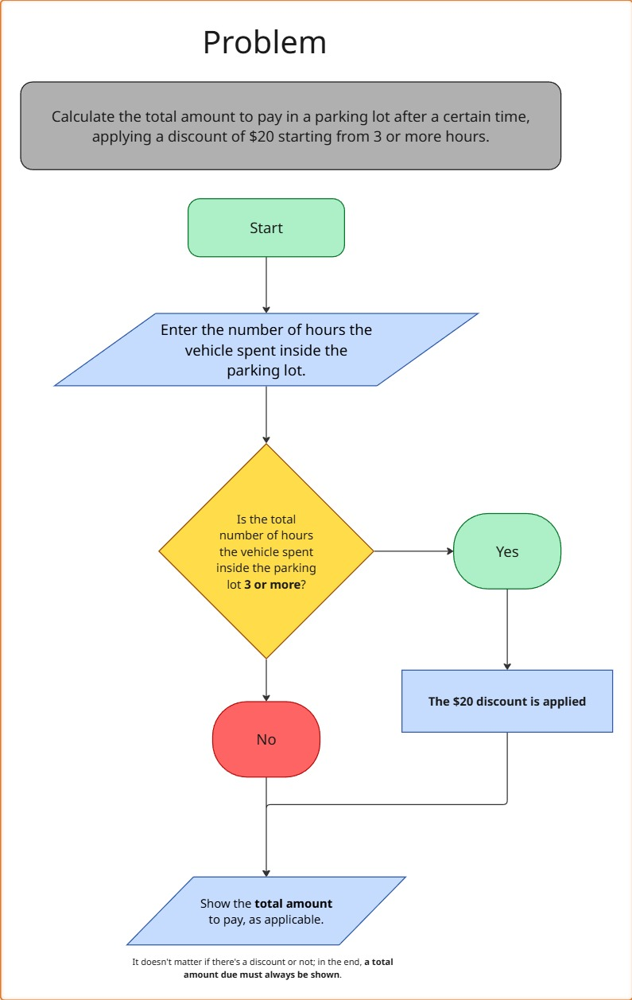

# Parking: Algorithm and pseudocode

## Problem statement
You must create the logic for a program that calculates the total amount due for parking.

The rules are:
- The rate is $15 per hour.
- If the customer stays for 3 hours or more, a $20 discount is applied to the total.

## Input:
- Hours (integer)
## The Algorithm
1. Start process.
2. Enter the number of hours the vehicle spent in the parking lot.
3. Calculate the total hours.
4. If the number of hours is greater than 3 hours, a discount is applied.
5. If the number of hours is less than 3 hours, the standard rate is maintained.
6. Display the total amount due, as applicable.
7. End of process.

*This algorithm is interested in the number of hours the vehicle spends in the parking lot; both the hourly parking cost and the discount can vary at any time.*

## Pseudocode
Start Process
- DEFINE variable “hours” of type integer with an initial value of 0.
- DEFINE variable “hourly_price” of type integer with an initial value of 15.
- DEFINE variable “discount” of type integer with an initial value of 20.
- DEFINE variable “total” of type integer with an initial value of 0.
- DISPLAY to the user “Enter the hours you were in the parking lot.”
- ASSIGN the user's value to the variable “hours.”
- MULTIPLY “hours” * “hourly_price” and ASSIGN to “total.”
- IF “hours” is greater than 3, SUBTRACT the variable “discount” from “total.”
- DISPLAY “total.”

**Note**: *I consider it to be only a "YES" given that there is only one decision in this algorithm because, regardless of whether there is a discount or not, a total number of hours of parking must be charged. I came to this conclusion because I created a flowchart where the decision can be seen.*

## Flowchart

